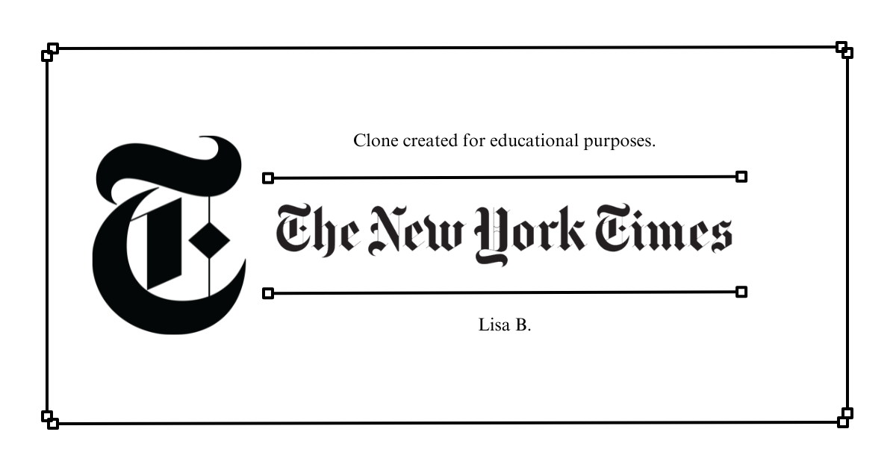

# New York Times Clone

## Description
This project is a clone of the New York Times made with React and the official API of the newspaper. This website is the React exam of the start2impact Master in Full Stack Development.

The application serves as a news article viewer, allowing users to search and browse articles from various sources.

## 📸 Screenshot


## 🔗 Link
https://lisab404.github.io/React-Project-NYT-Clone/

## Features
- Search functionality to find articles
- Article previews with relevant information
- Responsive design for mobile and desktop views

## Technologies Used
- React + React hooks
- Vite
- Axios (for fetching articles)
- CSS Modules for styling

## Installation
To get started with this project, clone the repository and install the dependencies:

```bash
git clone <repository-url>
cd <project-directory>
npm install
```

## Usage
To run the project locally, use the following command:

```bash
npm run dev
```

This will start the development server, and you can view the application in your browser at `http://localhost:3000`.

## Project Structure
The project is organized into the following directories:
- src: Contains the source code for the application.
- components: Contains reusable React components.
- assets: Contains images.

## Components
The application consists of the following components:

- App: The main application component.
- Header: The header component that contains the search bar and navigation.
- Navbar: The navigation bar component.
- Article: The article component that displays article previews.
- SearchResults: The search results component that displays a list of articles.
- Footer: The footer component that contains copyright information.
- Styles
The application uses CSS Modules for styling. Global styles are defined in src/index.css, and component-specific styles are defined in their respective CSS files.

## Contributing
Contributions are welcome! Please open an issue or submit a pull request for any improvements or features.

## License
This project is licensed under the MIT License.
